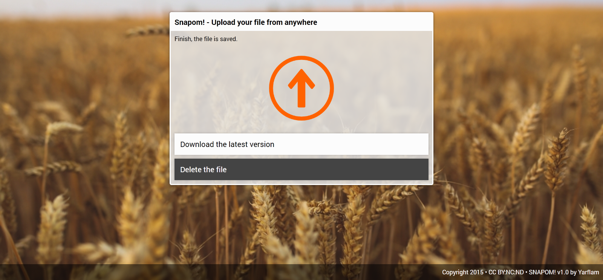

# Snapom! version 1.0

*La version officielle 1.0 est désormais disponible*



Snapom! est une application *Open Source* permettant d'**échanger des fichiers** entre plusieurs supports numériques connectés à internet.
Le système est entièrement *asymétrique* pour éviter les pannes réseaux et s'assurer que le fichier est complet.

L'intérêt de l'application est son inspiration pour le *versionning*. Lors d'un transfert, un seul fichier est impacté : *snapom-data*.
Ce fichier d'échange protège le serveur en isolant le fichier que vous envoyez.
On enregistre pas de nouveau fichier, on écrase l'existant.

Snapom! se veut utile pour de l'instantanée.

Il est fortement recommandé d'avoir une version de l'application par personne.
Pour en héberger plusieurs sur son serveur, on peut modifier le nom du fichier de stockage à la ligne 27.

```
27		self::$filename = "snapom-data"; /* The name of the repository file */
```

On peut également choisir la taille autorisée à la ligne 28.
Par défaut le maximum est de 100 Mo (10 puissance 8 octets).

```
28		self::$maxsize = pow(10,8); /* Max size allowed to upload (in octet) */
```

## Installation

L'installation n'est pas compliqué.

1. Connectez-vous à votre serveur avec un client FTP type Filezilla ou Cyberduck.

2. Envoyez les fichiers 'snapom.php' et 'snapom-data' se trouvant dans le répertoire '1.0'.

3. Modifiez ensuite les droits d'accès de 'snapom-data' pour permettre l'écriture (chmod 666)

Enjoy ;)

## Evolutions

La version 1.0 vient à peine de sortir qu'un correctif est déjà prévu, c'est merveilleux ! :D

En finissant le développement, je me suis rendu compte que la vitesse de transfert n'était pas optimale.
Je passe tout le contenu binaire en hexadécimal, le fichier double de taille.
En prenant en compte correctement l'encodage, je pense avoir trouvé un moyen d'envoyer du binaire directement.

Par ailleurs, il est probable que Snapom! s'équipe d'analyseurs réseaux plus avancés.

Profitez bien pour le moment. La version 1.0 est totalement stable, allez-y les yeux fermés ! :)